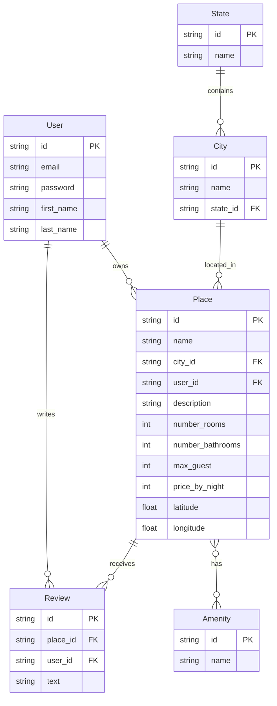

# AirBnB Clone v2 - Architecture Overview

This document describes the architectural design of the AirBnB Clone v2 project, highlighting the enhancements from v1.

## System Components

### Core Architecture

AirBnB Clone v2 follows an enhanced MVC architecture with dual storage support:

```mermaid
graph TD
    User[User] -->|CLI| Console[Console Controller]
    User -->|HTTP| Flask[Flask Application]
    Console --> Models[Models]
    Flask --> Models
    Models --> Storage[Storage Engine]
    Storage --> FileStorage[File Storage]
    Storage --> DBStorage[Database Storage]
    FileStorage --> JSON_File[JSON File]
    DBStorage --> MySQL[MySQL Database]
    
    subgraph "Controllers"
        Console
        Flask
    end
    
    subgraph "Models"
        Models --> BaseModel[BaseModel]
        BaseModel --> User_Model[User]
        BaseModel --> Place[Place]
        BaseModel --> State[State]
        BaseModel --> City[City]
        BaseModel --> Amenity[Amenity]
        BaseModel --> Review[Review]
    end
```

### Component Details

#### Models (`models/`)
- **BaseModel**: Enhanced parent class supporting both storage engines
- **Domain Models**: User, Place, State, etc. with SQLAlchemy mappings
- **Relationships**: Many-to-many, one-to-many between models

#### Storage Engines (`models/engine/`)
- **FileStorage**: JSON file-based storage from v1
- **DBStorage**: SQLAlchemy-based MySQL storage
- **Factory Pattern**: Dynamic selection based on environment variables

#### Web Application (`web_flask/`)
- **Routes**: HTTP endpoints for viewing states, cities, places
- **Templates**: Jinja2 templates for rendering HTML responses
- **Static Files**: Styles and images for web interface

#### Controllers
- **Console**: Command-line interpreter with key-value support
- **Web Controllers**: Flask route handlers

#### Deployment Automation
- **Server Setup**: Web server configuration scripts
- **Archive Management**: Packaging and deployment of static files
- **Lifecycle Management**: Versioning and cleanup

## Data Schema

The database schema shows the relationships between models:



## Data Flow

### Command Line Flow
1. User enters command in console
2. Console parses command with key-value support
3. Console creates/modifies model instances
4. Environment variables determine storage engine
5. ORM handles database operations (if DB storage)
6. Results displayed to user via console

### Web Application Flow
1. User accesses Flask route
2. Flask processes the request
3. Storage engine retrieves data
4. Data formatted through Jinja2 templates
5. Rendered HTML returned to user

## Storage Architecture

The dual storage system allows switching between file and database storage:

```mermaid
flowchart LR
    subgraph Environment
        ENV[Environment Variables]
    end

    subgraph Storage_Factory
        ENV -->|HBNB_TYPE_STORAGE=file| FileStorage
        ENV -->|HBNB_TYPE_STORAGE=db| DBStorage
    end
    
    subgraph File_Based
        Instance[Python Instance] -->|to_dict| Dictionary[Dictionary]
        Dictionary -->|json.dumps| JSONString[JSON String]
        JSONString -->|file.write| File[File.json]
        File -->|file.read| LoadedJSON[JSON String]
        LoadedJSON -->|json.loads| LoadedDict[Dictionary]
        LoadedDict -->|Class(**dict)| Instance
    end
    
    subgraph Database_Based
        DBInstance[Python Instance] -->|__dict__| DBMapping[SQLAlchemy Mapping]
        DBMapping -->|session.add| Session[DB Session]
        Session -->|session.commit| Database[MySQL DB]
        Database -->|session.query| QueryResult[Query Result]
        QueryResult -->|instance creation| DBInstance
    end
```

## Deployment Process

Web static deployment is automated using Fabric scripts:

```mermaid
flowchart TB
    Developer[Developer] -->|push code| GitRepo[Git Repository]
    GitRepo -->|clone| Server[Application Servers]
    
    Server -->|0-setup_web_static.sh| NginxConfig[Nginx Configuration]
    Server -->|1-pack_web_static.py| StaticArchive[Web Static Archive]
    StaticArchive -->|2-do_deploy_web_static.py| WebServers[Web Servers]
    
    WebServers -->|extract archive| ReleaseFolder[/data/web_static/releases/]
    ReleaseFolder -->|symbolic link| CurrentVersion[/data/web_static/current]
    
    NginxConfig -->|configure| Nginx[Nginx Web Server]
    Nginx -->|serve| StaticFiles[Static Files]
    
    Server -->|Flask| FlaskApp[Flask Application]
    FlaskApp -->|query| Database[(MySQL Database)]
```

## Environment Configuration

The application behavior can be configured using environment variables:

| Variable | Purpose | Example |
|----------|---------|---------|
| HBNB_TYPE_STORAGE | Storage engine selection (db/file) | db |
| HBNB_MYSQL_USER | MySQL username | hbnb_dev |
| HBNB_MYSQL_PWD | MySQL password | hbnb_dev_pwd |
| HBNB_MYSQL_HOST | MySQL host | localhost |
| HBNB_MYSQL_DB | MySQL database name | hbnb_dev_db |
| HBNB_API_HOST | API host for Flask | 0.0.0.0 |
| HBNB_API_PORT | API port for Flask | 5000 |

